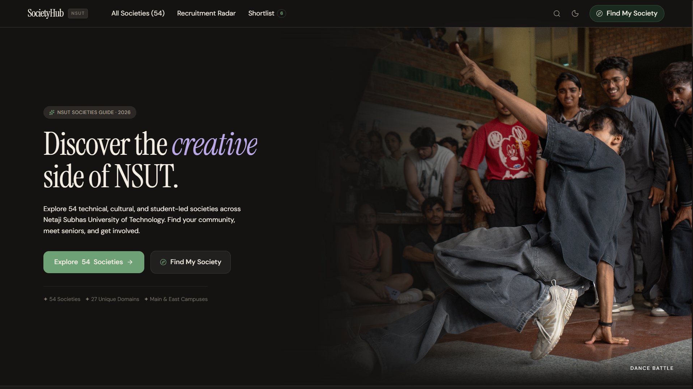
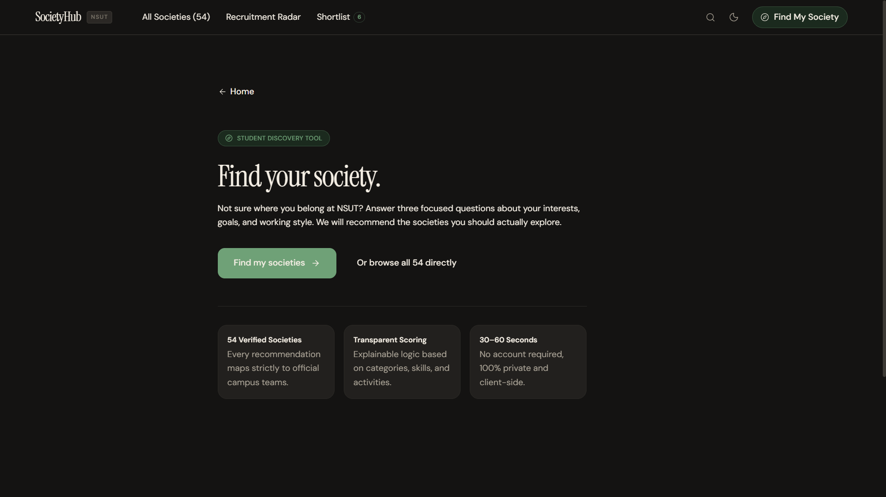
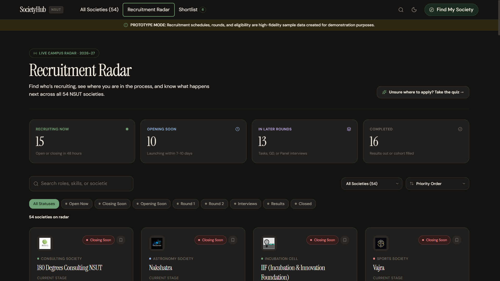
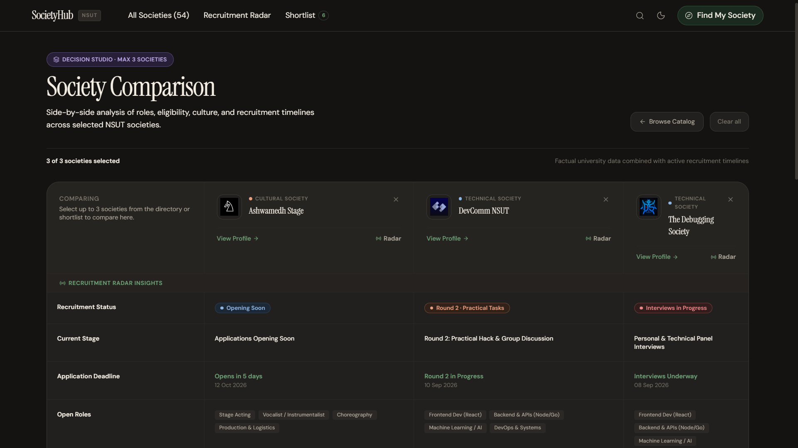

# SocietyHub

A student-built platform for discovering and exploring NSUT societies.

> Built as an entrance-task prototype.

## Live Demo

🔗 **[View SocietyHub Live](https://society-hub-chi.vercel.app/)**

## Features

- Browse 54 NSUT societies across multiple domains
- Fast search, filtering, sorting and typo-tolerant discovery
- **Find My Society** — personalized society recommendations
- **Recruitment Radar** — explore recruitment stages and timelines
- **Shortlist & Compare** — save societies and compare up to 3
- Responsive design with light/dark themes
- Accessible keyboard navigation and reduced-motion support

## Tech Stack

- React
- Vite
- JavaScript
- Tailwind CSS
- LocalStorage

## Screenshots

### Home


### Find My Society


### Recruitment Radar


### Compare


## Running Locally

```bash
npm install
npm run dev
